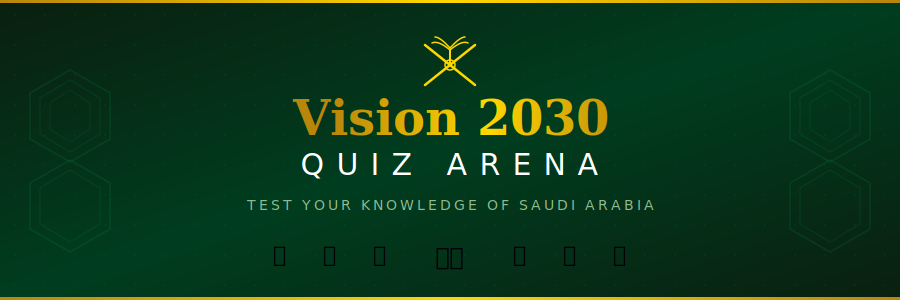
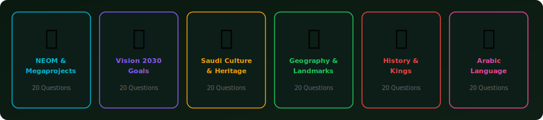
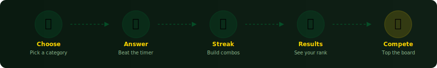

<p align="center">
  
</p>

<p align="center">
  
  
  
  
</p>

<p align="center">
  <b>🇸🇦 An interactive Saudi Arabia-themed educational quiz game</b><br/>
  <sub>Test your knowledge across six categories — from NEOM megaprojects to Arabic language</sub>
</p>

---

<br/>

## 🏗️ About The Project

**Vision 2030 Quiz Arena** is a feature-rich quiz game built to educate and challenge players on all things Saudi Arabia. Whether it's the futuristic megacity NEOM, the rich cultural heritage, or the ambitious goals of Saudi Vision 2030 — this game covers it all.

With adaptive difficulty, streak-based scoring, and a competitive leaderboard, every round is a fresh challenge.

<br/>

## 🇸🇦 Quiz Categories

<p align="center">
  
</p>

| # | Category | Icon | Color | Questions |
|---|----------|------|-------|-----------|
| 1 | **NEOM & Megaprojects** | 🏗️ | Cyan | 20 |
| 2 | **Vision 2030 Goals** | 📊 | Purple | 20 |
| 3 | **Saudi Culture & Heritage** | 🎭 | Amber | 20 |
| 4 | **Geography & Landmarks** | 🌍 | Green | 20 |
| 5 | **History & Kings** | 📜 | Red | 20 |
| 6 | **Arabic Language** | 🗣️ | Pink | 20 |

> **120 total questions** across 4 difficulty levels — Easy, Medium, Hard, and Expert

<br/>

## ⚡ Features

<table>
<tr>
<td width="50%">

### 🎮 Gameplay
- 10 timed questions per round
- Adaptive difficulty — gets harder as you streak
- Multiple choice with instant feedback
- Explanations after each answer

</td>
<td width="50%">

### 🏆 Progression
- XP and leveling system
- Rank badges — D, C, B, A, S
- Streak multiplier bonuses
- Time-based bonus points

</td>
</tr>
<tr>
<td width="50%">

### 📊 Leaderboard
- Top 10 high scores
- Saves locally in browser
- Gold, Silver, Bronze medals
- Track your best categories

</td>
<td width="50%">

### 🤖 AI-Powered (Optional)
- Mistral-7B question generation
- Hugging Face API integration
- Dynamic difficulty matching
- Falls back to built-in bank

</td>
</tr>
</table>

<br/>

## 🎯 How It Works

<p align="center">
  
</p>

<br/>

## 📈 Scoring System

<table>
<tr>
<th>🎯 Difficulty Scaling</th>
<th>⚡ Scoring Breakdown</th>
</tr>
<tr>
<td>

| Streak | Level | Timer |
|--------|-------|-------|
| 0 | 🟢 Easy | 20s |
| 3+ | 🟡 Medium | 20s |
| 5+ | 🟠 Hard | 15s |
| 7+ | 🔴 Expert | 10s |

</td>
<td>

| Component | Points |
|-----------|--------|
| Base (Easy → Expert) | 25 / 50 / 75 / 100 |
| Streak bonus | +10 per streak |
| Time bonus | Up to +20 |

</td>
</tr>
</table>

### 🏅 Rank System

```
  🥉 D Rank  ─  Below 40%     ░░░░░░░░░░
  🥉 C Rank  ─  40% - 59%     ████░░░░░░
  🥈 B Rank  ─  60% - 74%     ██████░░░░
  🥇 A Rank  ─  75% - 89%     ████████░░
  👑 S Rank  ─  90%+           ██████████
```

<br/>

## 🚀 Getting Started

### Prerequisites

- **Node.js** 18 or higher
- **npm** or **yarn**

### Installation

```bash
# Clone the repository
git clone https://github.com/Mohd6288/vision2030-QuizGame.git

# Navigate to project directory
cd vision2030-QuizGame

# Install dependencies
npm install

# Start development server
npm run dev
```

Open **[http://localhost:3000](http://localhost:3000)** in your browser.

### Production Build

```bash
npm run build
npm start
```

### AI Question Generation (Optional)

To enable AI-generated questions, set your Hugging Face API token:

```bash
export HF_TOKEN=your_hugging_face_token
```

> The game works fully without this — it falls back to the built-in 120-question bank.

<br/>

## 📁 Project Structure

```
vision2030-quiz/
│
├── 🎨 app/
│   ├── layout.tsx              # Root layout with navigation
│   ├── page.tsx                # Home — hero, categories, leaderboard
│   ├── globals.css             # Global styles & animations
│   ├── play/
│   │   └── page.tsx            # Game interface with timer
│   ├── results/
│   │   └── page.tsx            # Score, rank & leaderboard entry
│   └── api/
│       └── generate/
│           └── route.ts        # AI question generation endpoint
│
├── ⚙️ lib/
│   ├── questions.ts            # 120-question database (6 categories)
│   ├── game-engine.ts          # Scoring, difficulty & XP engine
│   └── leaderboard.ts          # localStorage leaderboard manager
│
├── 🖼️ public/
│   └── images/                 # SVG graphics & assets
│
├── package.json
├── tailwind.config.ts
├── tsconfig.json
└── next.config.js
```

<br/>

## 🛠️ Tech Stack

<p align="center">
  
  &nbsp;
  
  &nbsp;
  
  &nbsp;
  
</p>

<br/>

---

<p align="center">
  <sub>Built with 💚 for Saudi Arabia's Vision 2030</sub><br/>
  <sub>🇸🇦</sub>
</p>
